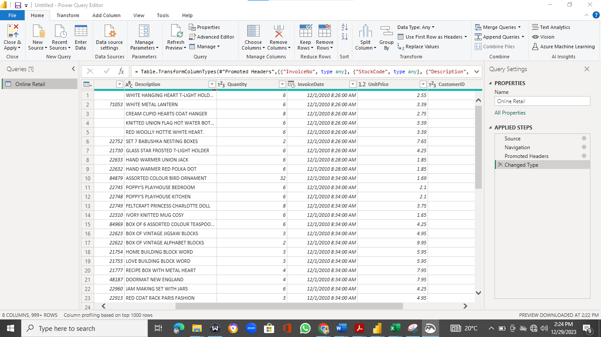
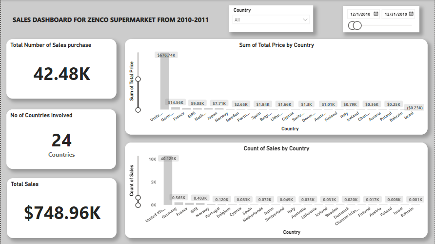
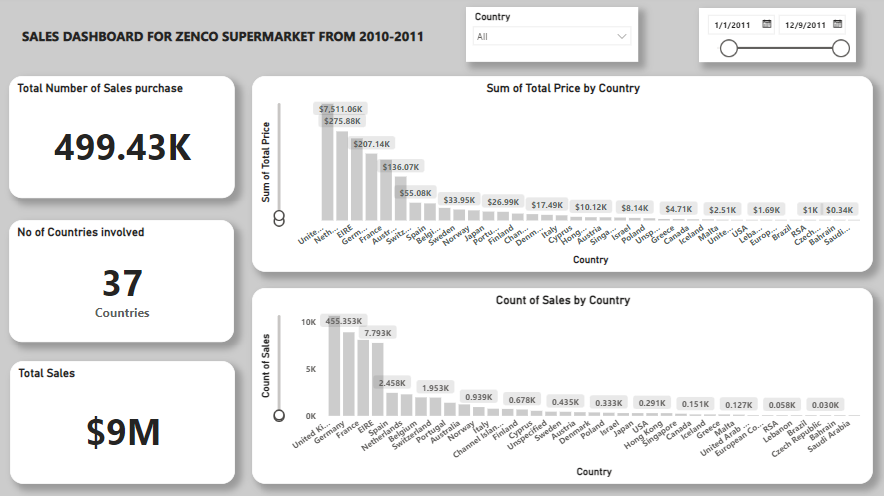
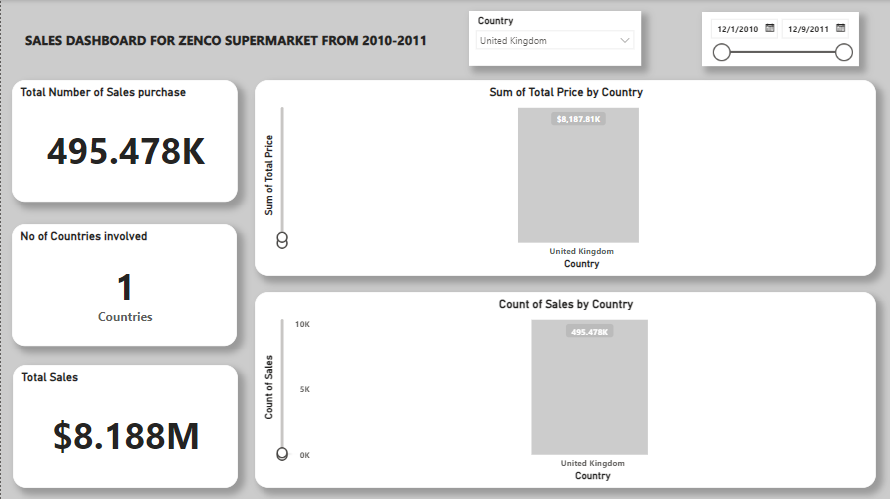
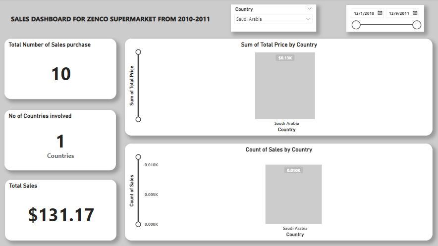
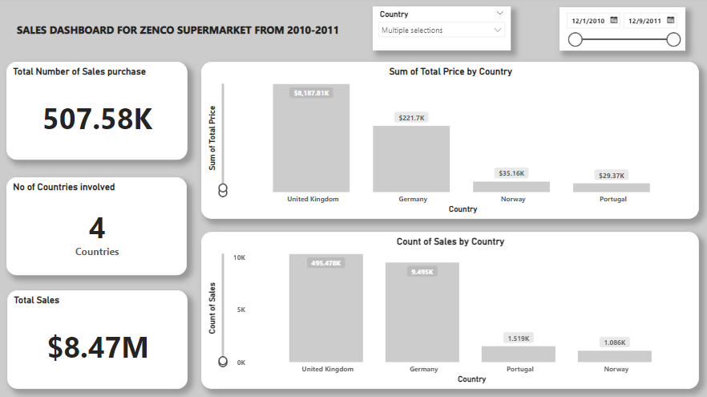

# Zenco-Sales-Analysis

**INTRODUCTION**
---

Engaged in a Power BI project focusing on sales analysis for the fictitious Zenco Supermarket, I encountered a dataset sourced online. My objective was to delve into the dataset, conduct a comprehensive analysis, and extract insights to address pivotal questions. The ultimate goal was to empower Zenco Supermarket to make informed, data-driven decisions based on the findings from the analysis. The dataset contains sales made from the 1st of December, 2010 till the 9th of December, 2011.

**Disclaimer:**  All datasets and reports do not represent any company, institution, or country.

Power Bi concept applied:	
- DAX Concept: Calculated column

**Problem Statement**
---
- Calculate the total sales at the end of each year, providing a clear snapshot of the annual performance. Additionally, aggregate the sales for both years to offer a comprehensive overview of the supermarket's overall performance.
- Identify and document the countries that actively patronize Zenco Supermarket, establishing a geographical understanding of the customer base.
- Determine the highest sales achieved by a specific country, shedding light on key markets and potential areas for growth or optimization.
- Identify the lowest sales made by a country, pinpointing areas that may require targeted marketing or operational improvements to enhance performance.
- Extract relevant, data-driven insights into our sales, exploring patterns, trends, or anomalies within the dataset. This analysis aimed to provide actionable information for strategic 
  decision-making and potential areas of improvement in the supermarket's sales strategy.

**Skills/concepts Demonstrated**
---
The following Power BI features were incorporated:
- DAX
- Page navigation
- Filters
- Button

**Data Sourcing**
---
The dataset used for analysis was collected from UCI Machine Learning online

**Data Cleaning and Transformation**
---
I conducted a thorough data cleaning process to identify and rectify any missing values or incorrectly formatted data. Notably, I observed that the unit price column was in text format. I addressed this by converting it to currency format. Additionally, I created a new column to calculate the total price by multiplying the unit price by the quantity, enhancing the dataset's accuracy and providing a more comprehensive view of the financial aspects involved.

  

**Analysis and Visualization**
---
1.	Sales transactions were conducted with individuals from 38 different countries. Each year, total sales figures were calculated. Notably, the data for the year 2010 was limited to December, with a recorded total sales amount of $748,960.

       

     In contrast, the sales data for the year 2011 spanned from January to December 9th, accumulating a total amount of $9,000,000. Given the restricted timeframe of sales recorded for 2010, it is challenging to definitively determine which year performed better.

       

  	 The limitation in the duration of sales data for 2010 hinders a comprehensive comparison of the two years' overall sales performance. This brings total sales to $9,748,960.

2.	Zenco Supermarket engaged in sales transactions with a total of 38 countries, showcasing a broad international reach spanning six continents: Europe, Asia, North America, South America, Australia, and Africa (listed from the largest to the smallest in sales transactions).
   
3.	Upon analyzing the data, a notable trend emerged, indicating that the majority of sales transactions occurred in European countries. Specifically, the United Kingdom emerged as the highest contributor to sales with a total of $8,188,000.

       

4.	In contrast, Africa displayed the least participation, with South Africa being the sole representative having total sales of $131.17. The distribution of sales transactions across continents offers insights into regional preferences and market dynamics, with Europe, particularly the United Kingdom, standing out as a prominent market for Zenco Supermarket.

       

**Insights** 
---
1.	It was observed that the total number of sales purchases doesn’t determine the total sales. As displayed below Norway had a total number of sales of 1,086 while Portugal had 1,519 but the total sales of Norway tend to be higher than Portugal, having a total sale of $35,160 with Portugal having $29,370.
   
       

**Recommendations**
---
1. **Expand Market Presence:** While the European market, especially the United Kingdom, has shown strong performance, there is potential for growth in other continents. Consider strategies to expand market presence in underrepresented regions like Africa. This could involve targeted marketing campaigns, understanding local preferences, and adapting the product offerings to suit diverse markets.

2. **Diversify Product Range:** To cater to the varying preferences in different regions, Zenco Supermarket could consider diversifying its product range. Conduct market research in each region to identify popular products and tailor the inventory accordingly. This approach can help tap into the unique demands of diverse customer bases.

3. **Improve Data Collection:** Enhance data collection methods to provide a more comprehensive analysis of sales performance. This includes ensuring consistent recording of sales data throughout the year, allowing for a more accurate year-to-year comparison. A thorough understanding of sales patterns can guide strategic decision-making.

4. **Explore Partnership Opportunities:** Collaborate with local businesses or distributors in regions with lower sales participation. Partnering with local entities can provide insights into consumer behavior, streamline distribution channels, and increase overall sales.

5. **Optimize Sales in Strong Markets:** While focusing on expanding into new markets, it's crucial to continue optimizing sales in strong-performing regions. Implement loyalty programs, promotions, or partnerships to maintain and potentially increase sales in key markets, such as the United Kingdom.

**Conclusion**
---
- Zenco Supermarket has demonstrated a solid international presence, engaging with customers from 38 different countries across six continents. The concentration of sales in European countries, particularly the United Kingdom, suggests a strong foothold in that market. However, the limited data for the year 2010 makes a direct comparison with 2011 challenging.
  
- To make informed decisions, Zenco Supermarket should invest in more robust data collection processes, ensuring a consistent and comprehensive record of sales across all regions. This will facilitate accurate performance evaluations and enable the identification of growth opportunities in both established and emerging markets.
  
- By diversifying the product range, exploring new partnerships, and strategically addressing underperforming regions, Zenco Supermarket can position itself for sustained growth and success in the competitive global market.

